# System Design & Architecture

## 1. Research Question

### 1.1 Research Question

The central research question is:

**How can Decap CMS be enhanced to support MDX authoring, dynamic internal linking, and decentralized media handling while remaining compatible with static site generators such as Docusaurus?**

---

## 2. Design Principles & Architecture Overview

### 2.1 Design Principles

The system is designed with the following core principles to ensure extensibility, developer-friendliness, and robust content handling:

| Principle                  | Description                                                                                              |
| -------------------------- | -------------------------------------------------------------------------------------------------------- |
| **Modular Architecture**   | Components such as MDX parser, link resolver, and image handler are decoupled for independent evolution. |
| **Backward Compatibility** | Enhancements do not interfere with existing Decap CMS workflows or static site compatibility.            |
| **Developer-Centric UX**   | Built using React, TypeScript, and Webpack for easy integration and contribution.                        |
| **Authoring Simplicity**   | Non-technical users benefit from live previews and structured inputs.                                    |
| **Git-Centric Workflow**   | Version control remains core to content and configuration tracking.                                      |
| **Output Validation**      | All changes pass automated validation checks to maintain production safety.                              |
| **Preview Accuracy**       | In-CMS preview mirrors final Docusaurus rendering with fidelity.                                         |

### 2.2 Architecture Overview

#### 2.2.1 High-Level Architecture

#### 2.2.2 Technology Stack

| Layer       | Technology                     | Purpose                                          |
| ----------- | ------------------------------ | ------------------------------------------------ |
| Frontend    | React, TypeScript              | Authoring interface and live component preview   |
| MDX         | `@mdx-js/mdx`, `@mdx-js/react` | MDX parsing and JSX rendering                    |
| Build Tool  | Webpack                        | Compilation and bundling                         |
| CMS         | Decap CMS (custom fork)        | Git-based content editing platform               |
| Static Site | Docusaurus                     | Site generation engine                           |
| Hosting     | Netlify                        | Continuous deployment and preview infrastructure |

---

## 3. System Requirements

The system is driven by the following core requirements:

### 3.1 Functional Requirements:

- Author MDX with embedded React components.
- Resolve internal links based on file tree structure.
- Upload and reference images in local `assets/` folders.
- Provide real-time preview of content, links, and images.

### 3.2 Non-Functional Requirements:

- Maintain compatibility with Git and Docusaurus builds.
- Provide editor validation (JSX syntax, broken links, missing assets).
- Ensure minimal performance overhead in editor preview.

---

## 4. MDX Integration

### 4.1 Authoring Pipeline

**Overview:**

- Uses `@mdx-js/mdx` to parse `.mdx` files into React AST.
- JSX components (e.g., `<ZoomableImage />`) are rendered live.
- Validation occurs via Babel and ESLint rules.

**Workflow:**

1. Author writes content in `*.mdx` file.
2. MDX parser transforms content into JSX.
3. Live preview renders the output using React.
4. Output is stored as plain MDX, ready for Docusaurus.

**Validation:**

- Syntax errors are highlighted inline.
- Missing JSX components trigger fallback UIs.

### 4.2 MDX Content Processing

- AST generation through unified + remark plugins
- Table formatting and sanitization for compatibility
- JSX and custom components are type-checked
- Internal links are preprocessed into a normalized format

---

## 5. Internal Linking

### 5.1 Link Resolver

**Architecture:**

- Maintains a memory-based map of the folder structure.
- Automatically calculates relative paths for links.
- Validates links at runtime and preview.

**Workflow:**

1. Author selects a target file using folder-aware modal.
2. Resolver generates the relative path.
3. Live preview renders the working link.
4. Invalid links are flagged in red.

---

## 6. Image Management

### 6.1 Decentralized Asset Handling

**Architecture:**

- Media uploaded through CMS is stored in a content-specific `/` folder.
- Paths are normalized for Docusaurus compatibility.

**Workflow:**

1. Author uploads image via custom Component.
2. Image is stored in current directory.
3. Preview layer resolves the image dynamically.
4. Final output contains relative paths (`./assets/image.png`).

**Fallback Handling:**

- Missing images are shown as placeholders.
- Broken references are flagged visually.

---

## 7. Use Case Analysis

### 7.1 Actors

- **Content Authors**: Use CMS to create/edit documentation.
- **Developers**: Maintain schema, components, and build pipelines.
- **Maintainers**: Review commits and validate site builds.

### 7.2 Use Cases

- **Author Interactive Guide**: Embed `<Callout />` or `<CodeTabs />` components in documentation.
- **Update Folder Structure**: Rename/move folders; links remain valid due to resolver.
- **Insert Diagram**: Upload image in editor, auto-resolves path relative to file.

---

## 8. Conclusion

This system transforms Decap CMS into a modern documentation platform by adding MDX authoring, folder-aware internal linking, and decentralized media handling. It enhances both developer extensibility and editor usability.

### Next Steps:

- Implement core subsystems (Weeks 4–9).
- Perform usability testing with documentation teams.
- Conduct performance profiling and optimize editor runtime.
- Finalize validation rules and error logging.

The result is a scalable, Git-friendly documentation toolchain aligned with modern static site workflows.
