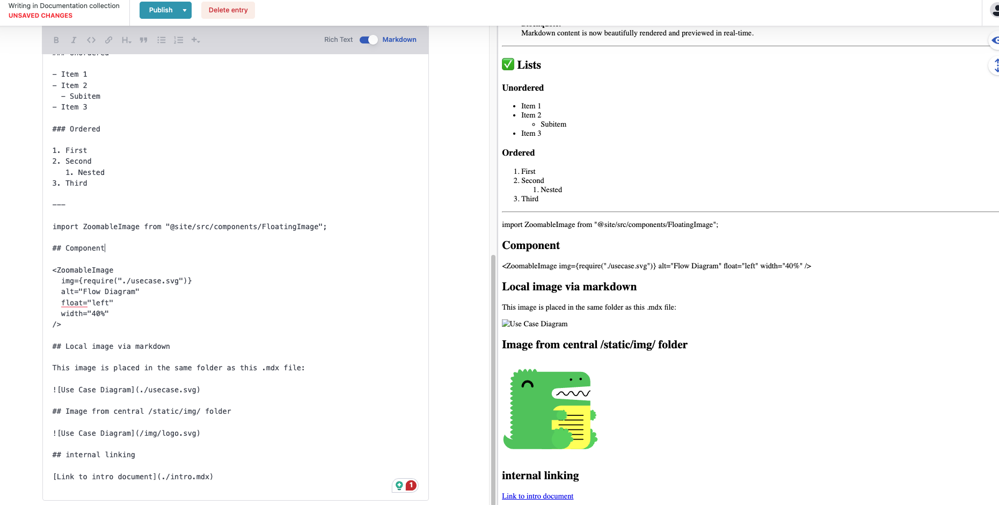

# Image from the same folder as this file

### Project Overview

This thesis focuses on extending the open-source headless CMS, [**Decap CMS**](https://decapcms.org/), to support [**MDX** (Markdown + JSX)](https://mdxjs.com/), while also improving flexibility and usability for modern documentation and content workflows.

### Problem Statement

Many open-source CMS platforms lack modern features like MDX support, internal linking, and modular image handling. This makes it hard to build scalable and interactive documentation without resorting to expensive or complex alternatives.

---

## Thesis Objectives & Scope

### Primary Objectives

- Enable authors to write JSX components directly inside the Decap CMS editor.
- Support live preview of JSX inside the editor.
- Implement internal linking that adapts to folder structure.
- Enhance image management to support decentralized media folders.

### Key Deliverables

- An extended, production-ready version of Decap CMS.
- Integration with a Docusaurus site.
- Full documentation of the implementation and testing process.

---

## Detailed Tasks

1. **MDX Integration**

   - Extend Decap CMS’s backend and editor to support `.mdx` files.
   - Enable React component previews directly inside the CMS editor.
   - Allow authors to insert reusable JSX elements (e.g., charts, callouts).

2. **Internal Linking**

   - Add a mechanism to resolve internal links dynamically based on folder structure.
   - Ensure they work correctly in both edit and preview mode.

3. **Image Management**

   - Support decentralized image storage so that each content folder can have its own assets.
   - Allow previews to render correctly regardless of file location.

---

## Methodology

The thesis follows the **Design Science Research (DSR)** methodology, which focuses on building and evaluating technical artifacts. This is ideal for a project that involves designing, implementing, and validating a real-world CMS extension.

---

## Timeline (3 Months)

- **Weeks 1–2:** Research Decap CMS, MDX, and related tools
- **Week 3:** Define technical architecture and implementation strategy
- **Weeks 4–9:** Implement MDX support, internal linking, and image handling
- **Weeks 10–11:** Testing and optimization
- **Weeks 12–13:** Thesis writing and submission preparation

---

## Background: CMS, MDX & Docusaurus

A **CMS (Content Management System)** lets users create, manage, and publish digital content. Traditional CMSs (e.g., WordPress) are tightly coupled to presentation layers, while headless CMSs like Decap separate content management from display logic.

**MDX** is a format combining Markdown and JSX, allowing developers to embed React components inside Markdown files. This is particularly valuable for technical documentation, where dynamic content is often required.

**Docusaurus** is an open-source static site generator built by Meta, designed specifically for creating fast, modern documentation websites. It supports:

📘 Markdown and MDX (Markdown + JSX)

⚛️ Built with React, so you can embed components directly in your content

🌍 Supports versioning, i18n, and custom theming

⚡ Fast build times using Vite or Webpack

Ideal for product docs, project wikis, knowledge bases, and technical documentation sites.

## Why Decap CMS?

- Git-based, open-source, and easy to integrate
- Works well with static site generators like Docusaurus
- Lightweight and developer-friendly, making it ideal for extensions

## Why MDX?

- Enables modular, reusable, and interactive content
- Perfect for documentation use cases that require dynamic elements like code snippets, callouts, or charts

## Why Docusaurus?

- The client’s existing documentation platform is built on [Docusaurus](https://docusaurus.io/) , making it the natural choice for extending CMS capabilities and ensuring full compatibility with their current static site workflow.

## Validation

- Build a working prototype integrated with Docusaurus
- Test usability with real content editors
- Evaluate performance and user experience

---

## Expected Outcomes

- A fully functioning CMS based on Decap CMS
- Extended features for MDX, internal links, and media
- Real-world integration into a documentation platform
- A completed bachelor thesis with technical and academic evaluation

---

## 📸 Current CMS Limitations (Before Implementation)

The screenshot below demonstrates the current limitations of Decap CMS before applying any of the thesis extensions:

- ❌ JSX/MDX components (like `<ZoomableImage />`) are not rendered in preview.
- ❌ Images placed in the same folder as the content (e.g., `./usecase.svg`) are not displayed.
- ✅ Images from the `/static/` folder render correctly.
- ❌ Internal links is not wroking.

> These issues validate the need for this thesis project and demonstrate the gap the final implementation aims to fill.

---

## 🔗 Project Repository

The full source code for this CMS extension is maintained publicly on GitHub:
👉 [Github](https://github.com/niravbhuva99/cms-thesis-project)

This repository represents the core development effort of this thesis.
By the end of the project, it will contain a fully working prototype of the extended Decap CMS integrated with a Docusaurus site, demonstrating live JSX previews, internal linking, and advanced image handling.

🟢 The project is also deployed on Netlify, so you can directly explore the documentation site:
👉 [Live Demo on Netlify](https://celebrated-maamoul-edd9d7.netlify.app/)

## Summary

This project bridges the gap between static documentation platforms and flexible, dynamic CMS features. Through MDX integration, smarter media handling, and a live preview editor, non-technical users can manage interactive content easily — while developers retain full control over structure and rendering.
