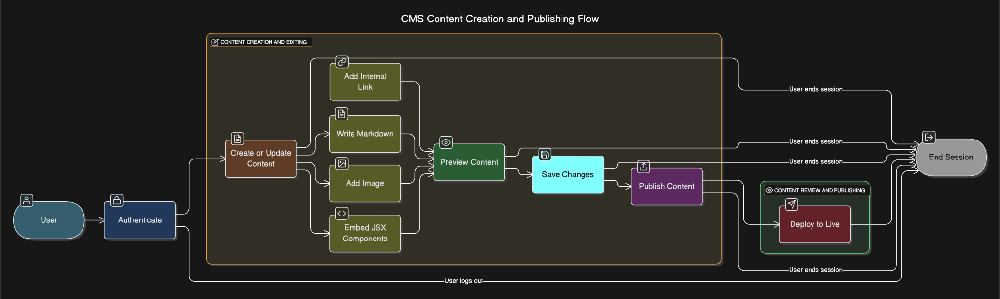

## 1. Introduction

### 1.1 Purpose

This document outlines the functional and non-functional requirements for extending Decap CMS to support MDX (Markdown with JSX), internal linking, and enhanced image management. The goal is to overcome current limitations in content workflows while adhering to Decap CMS’s open-source principles.

### 1.2 Scope

The scope of this project includes:

- **MDX Integration** – Enable embedding of JSX components within Markdown content.
- **Internal Linking** – Ensure internal links function correctly, including in preview mode.
- **Image Management** – Allow image uploads to be organized per content folder.
- **Open-Source Compliance** – Maintain compatibility with Decap CMS architecture and licensing.
- **TypeScript Support Awareness** – Ensure JSX/TSX code blocks do not break MDX parsing.
- **Style Integration** – Enable styled components and class-based CSS within the MDX content.
- **JavaScript Compatibility** – CMS functionality should be authored using React (with TypeScript/JSX if needed), but the compiled output must be Vanilla JavaScript to maintain CMS compatibility.

### 1.3 Stakeholders

- **Content Authors** – Require reusable, interactive components for rich documentation.
- **Developers** – Need seamless integration with React-based static site tools like Docusaurus or Next.js.
- **Project Maintainers** – Expect backward compatibility and easy extensibility for long-term sustainability.

---

## 2. Objectives

### 2.1 Primary Goals

1. **Enable MDX Integration in Decap CMS**:
   Extend Decap CMS to support editing MDX files, including the ability to insert and render JSX components directly within the content editor and live preview.

2. **Implement Intelligent Internal Linking**:
   Automatically resolve internal links based on the content folder and file structure, ensuring they function correctly during both editing and preview.

3. **Enhance Image Handling**:
   Allow image uploads to be stored in content-specific folders, and ensure consistent preview and rendering across different storage paths.

4. **Ensure Build-Safe Output for Docusaurus**:
   Guarantee that all CMS-generated MDX files compile successfully during static site builds with Docusaurus, without requiring manual fixes.

5. **Mirror Final Styling in Preview**:
   Ensure the live preview inside the CMS accurately reflects the final styling seen on the deployed site — including class-based styles and layout — so that content authors can see how their content will truly appear on the webpage.

---

## 3. System Requirements

### 3.1 Functional Requirements

#### 3.1.1 MDX Integration

| ID        | Description                                                                | Priority |
| --------- | -------------------------------------------------------------------------- | -------- |
| FR-MDX-01 | Parse MDX files and render embedded JSX components in the editor preview.  | High     |
| FR-MDX-02 | Ensure CMS output is compatible with Docusaurus MDX rules.                 | High     |
| FR-MDX-03 | Support dynamic elements (e.g., interactive buttons or forms) in previews. | High     |
| FR-MDX-04 | Provide JSX syntax validation and inline error feedback while editing.     | Medium   |

#### 3.1.2 Internal Linking

| ID         | Description                                                              | Priority |
| ---------- | ------------------------------------------------------------------------ | -------- |
| FR-LINK-01 | Dynamically resolve internal links based on file and folder structure.   | High     |
| FR-LINK-02 | Validate links during preview to prevent broken or incorrect references. | High     |

#### 3.1.3 Image Management

| ID        | Description                                                                | Priority |
| --------- | -------------------------------------------------------------------------- | -------- |
| FR-IMG-02 | Display image previews regardless of where they are stored in the project. | High     |

#### 3.1.4 Style Support

| ID         | Description                                                             | Priority |
| ---------- | ----------------------------------------------------------------------- | -------- |
| FR-STYL-01 | Support className injection for Tailwind or Docusaurus theme styling.   | Medium   |
| FR-STYL-02 | Allow Markdown and JSX blocks to include inline or class-based styling. | Medium   |

---

### 3.2 Non-Functional Requirements

| ID           | Description                                                                | Priority |
| ------------ | -------------------------------------------------------------------------- | -------- |
| NFR-COMP-02  | Maintain compatibility with Vanilla JavaScript at CMS-level logic.         | High     |
| NFR-COMP-03  | Maintain compatibility with standard Markdown (.md) files.                 | High     |
| NFR-EXT-04   | Use modular architecture to allow for future feature extensions.           | Medium   |
| NFR-BUILD-05 | Output files must not cause Docusaurus build errors during CI/CD pipeline. | High     |
| NFR-SEC-06   | Define acceptable preview load times for MDX with embedded JSX components. | Medium   |
| NFR-TEST-08  | Specify how syntax errors in MDX/JSX are logged and displayed to users.    | High     |

---

## 4. Use Case Overview

### 4.1 Actors

- **Content Editor** – The person writing and managing content via Decap CMS.
- **System** – The extended Decap CMS with support for MDX, linking, and media handling.

### 4.2 Main Use Case Flow

1. The user logs into the CMS interface.
2. The user creates a new content file or selects an existing one.
3. The user writes Markdown, inserts JSX components, adds links, and uploads images.
4. The system shows a live preview. The user validates and updates the content as needed.
5. The user saves changes.
6. The system commits updates to a Git repository and triggers a build via a static site generator (e.g., Docusaurus or Next.js).

**Activity Flow Diagram**

### 4.3 Technical Constraints

| Constraint             | Description                                                                 |
| ---------------------- | --------------------------------------------------------------------------- |
| Static Site Generation | Must integrate with static site generators like Docusaurus                  |
| Limited Backend Access | No traditional database; all content is file-based                          |
| Build-Safe Output      | All CMS-generated MDX must compile without errors in Docusaurus builds      |
| Modular Architecture   | React app handles MDX preview; compiled to JS via Webpack for CMS injection |

---

## 5. Assumptions

- Decap CMS’s architecture allows extending the editor with React-based preview components.
- MDX v2+ is supported by the target static site generators (Docusaurus/Next.js).
