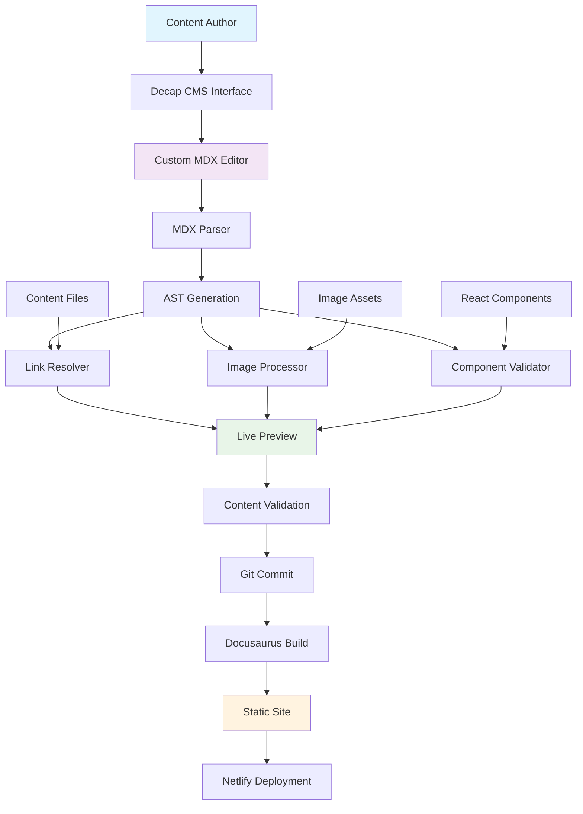

# Repository Explanation: Extending Decap CMS for Modern Documentation Workflows

## 📋 Project Overview

This repository contains a **Bachelor's Thesis project** by Nirav Babubhai Bhuva from Hochschule Merseburg. The project extends **Decap CMS** (formerly Netlify CMS) to support modern documentation features that were previously unavailable in traditional content management systems.

### What Problem Does This Solve?

Traditional CMS platforms have limitations when it comes to:
- **Interactive Content**: They can't handle React components mixed with Markdown
- **Smart Linking**: Internal links often break when content is moved around
- **Media Management**: Images must be stored in central folders rather than alongside content
- **Developer Experience**: No live preview of complex components during editing

This project bridges the gap between simple content management and modern web development needs.

## 🎯 Core Objectives

The thesis addresses three main challenges:

### 1. **MDX Integration** 🔧
- **What it is**: MDX = Markdown + JSX (React components)
- **Why it matters**: Allows authors to embed interactive elements like charts, callouts, and custom components directly in content
- **Before**: Only plain Markdown was supported
- **After**: Authors can write `<ZoomableImage />` or `<CodeTabs />` directly in their content

### 2. **Intelligent Internal Linking** 🔗
- **What it is**: Smart resolution of links between documents
- **Why it matters**: Links automatically adjust when content is moved or renamed
- **Before**: Moving a file broke all links pointing to it
- **After**: Links work dynamically based on folder structure

### 3. **Decentralized Image Management** 📸
- **What it is**: Images stored alongside content rather than in a central folder
- **Why it matters**: Better organization and content portability
- **Before**: All images had to go in `/static/` folder
- **After**: Each content folder can have its own images

## 🏗️ System Architecture

### High-Level Architecture

```
┌─────────────────────────────────────────────────────────────────┐
│                    USER INTERFACE LAYER                         │
├─────────────────────────────────────────────────────────────────┤
│  Decap CMS Editor (React/TypeScript)                           │
│  ├── Custom MDX Widget (editor.tsx)                            │
│  ├── Live Preview Component                                     │
│  ├── Image Upload Widget                                        │
│  └── Internal Link Resolver                                     │
├─────────────────────────────────────────────────────────────────┤
│                   PROCESSING LAYER                              │
├─────────────────────────────────────────────────────────────────┤
│  MDX Processing Pipeline                                        │
│  ├── @mdx-js/mdx (MDX Parser)                                  │
│  ├── Abstract Syntax Tree (AST) Generation                     │
│  ├── JSX Component Validation                                   │
│  ├── Link Resolution Engine                                     │
│  └── Image Path Normalization                                   │
├─────────────────────────────────────────────────────────────────┤
│                    BUILD LAYER                                  │
├─────────────────────────────────────────────────────────────────┤
│  Webpack Build System                                          │
│  ├── TypeScript Compilation                                     │
│  ├── React Component Bundling                                   │
│  ├── CSS Processing (Tailwind)                                  │
│  └── Output: browser-compatible bundle.js                       │
├─────────────────────────────────────────────────────────────────┤
│                   CONTENT LAYER                                 │
├─────────────────────────────────────────────────────────────────┤
│  Git Repository (Content Storage)                              │
│  ├── /docs/ (MDX content files)                                │
│  ├── /static/ (global assets)                                  │
│  ├── Local /assets/ (content-specific images)                  │
│  └── Configuration files                                        │
├─────────────────────────────────────────────────────────────────┤
│                  DEPLOYMENT LAYER                              │
├─────────────────────────────────────────────────────────────────┤
│  Docusaurus Static Site Generator                              │
│  ├── MDX Compilation                                           │
│  ├── React Component Rendering                                  │
│  ├── Static Site Generation                                     │
│  └── Netlify Deployment                                         │
└─────────────────────────────────────────────────────────────────┘
```

### Technology Stack Overview

| **Layer** | **Technology** | **Purpose** |
|-----------|----------------|-------------|
| **Frontend** | React + TypeScript | CMS editing interface and component preview |
| **Content Processing** | @mdx-js/mdx, @mdx-js/react | MDX parsing and JSX rendering |
| **Build System** | Webpack 5 | Module bundling and compilation |
| **CMS Core** | Decap CMS (extended) | Git-based content management |
| **Static Site** | Docusaurus v3 | Documentation site generation |
| **Styling** | Tailwind CSS | UI styling and component design |
| **Deployment** | Netlify | Continuous deployment and hosting |

## 🔍 Key Components Deep Dive

### 1. Custom MDX Editor (`customEditor/src/editor.tsx`)

This is the **heart of the extension**. It replaces Decap CMS's default Markdown editor with an MDX-aware editor.

**What it does:**
- **Parses MDX**: Converts MDX content into Abstract Syntax Trees (AST)
- **Live Preview**: Renders React components in real-time as you type
- **Validation**: Checks for syntax errors and missing components
- **Component Registry**: Manages available React components for MDX

**Key Features:**
```typescript
// Real-time MDX processing
const generateAST = (markdown: string) =>
  fromMarkdown(markdown, {
    extensions: [mdxJsx({ acorn, addResult: true })],
    mdastExtensions: [mdxJsxFromMarkdown()],
  });

// Live preview with React components
<MdxPreview mdx={mdxProps} {...props} value={out} />
```

### 2. Link Resolution System

**Problem Solved**: Traditional CMSs break links when files are moved.

**How it works:**
1. **File Structure Mapping**: Maintains a memory map of all content files
2. **Relative Path Calculation**: Automatically calculates correct paths between files
3. **Real-time Validation**: Checks links during preview and flags broken ones
4. **Dynamic Updates**: Adjusts links when content structure changes

### 3. Image Management Pipeline

**Traditional Approach**: All images in `/static/` folder
**New Approach**: Images stored alongside content

**Processing Flow:**
```
Upload Image → Store in Content Folder → Normalize Path → Preview → Deploy
```

### 4. MDX Processing Pipeline

```
Raw MDX Input → AST Generation → Component Validation → Link Processing → Final Output
```

**Stages:**
1. **Parsing**: MDX content → Abstract Syntax Tree
2. **Validation**: Check JSX syntax and component availability  
3. **Link Processing**: Resolve internal links and validate targets
4. **Component Injection**: Add React components to preview scope
5. **Rendering**: Generate live preview that matches final output

## 🛠️ Development Workflow

### For Content Authors:
1. **Login**: Access CMS through web interface
2. **Create/Edit**: Write content using visual editor
3. **Preview**: See real-time preview with live components
4. **Validate**: System checks for errors automatically
5. **Publish**: Save triggers Git commit and site rebuild

### For Developers:
1. **Component Development**: Create React components in `/src/components/`
2. **Registration**: Register components in the CMS scope
3. **Testing**: Use local development server for testing
4. **Integration**: Components become available to content authors

## 📊 Architecture Diagram



## 🎯 Innovation and Contributions

### Technical Innovations:

1. **Hybrid Architecture**: Combines static site generation with dynamic CMS capabilities
2. **Real-time MDX Processing**: Live preview of complex React components during editing
3. **Intelligent Path Resolution**: Automatic link management across folder structures
4. **Modular Component System**: Easy registration and management of custom components

### Research Contributions:

1. **Extended CMS Capabilities**: Proves headless CMSs can support modern web development workflows
2. **Seamless Integration**: Demonstrates successful integration between Git-based CMS and static site generators
3. **User Experience Enhancement**: Bridges gap between developer tools and content author needs

## 🚀 Practical Applications

### Use Cases:
- **Technical Documentation**: Interactive guides with embedded demos
- **Educational Content**: Lessons with interactive elements and media
- **Product Documentation**: Feature descriptions with live examples
- **Knowledge Bases**: Searchable content with rich media and cross-references

### Benefits:
- **For Authors**: Visual editing with live preview
- **For Developers**: Component reusability and consistent rendering
- **For Organizations**: Maintainable documentation workflows
- **For Users**: Rich, interactive content consumption

## 📈 Impact and Significance

### Academic Impact:
- **Research Question**: Successfully answers how to extend headless CMSs for modern workflows
- **Methodology**: Follows Design Science Research (DSR) approach
- **Validation**: Working prototype demonstrates feasibility

### Industry Relevance:
- **Open Source Contribution**: Extensions can benefit broader Decap CMS community
- **Workflow Innovation**: Sets precedent for modern documentation toolchains
- **Cost Efficiency**: Provides enterprise-grade features using open-source tools

## 🔧 Technical Implementation Details

### Key Files and Their Purposes:

| **File/Directory** | **Purpose** |
|-------------------|-------------|
| `customEditor/src/editor.tsx` | Core CMS extension logic |
| `src/components/` | Reusable React components for MDX |
| `docs/thesis/` | Thesis documentation and examples |
| `webpack.config.js` | Build system configuration |
| `docusaurus.config.ts` | Static site generator configuration |
| `package.json` | Dependencies and project metadata |

### Build Process:
1. **Development**: `npm run dev` starts Webpack dev server
2. **Production**: `npm run build` compiles CMS extension and builds site
3. **Deployment**: Automatic deployment to Netlify on Git commits

## 🎓 Thesis Evaluation Criteria

### Technical Achievement:
- ✅ **Functional Extension**: Successfully extends Decap CMS
- ✅ **Integration**: Seamless Docusaurus integration
- ✅ **Innovation**: Novel approach to CMS-static site workflows

### Research Quality:
- ✅ **Problem Definition**: Clear identification of CMS limitations
- ✅ **Solution Design**: Well-architected technical solution
- ✅ **Implementation**: Working prototype with real-world applicability
- ✅ **Evaluation**: Demonstrates improved workflow efficiency

### Documentation Quality:
- ✅ **Comprehensive**: Detailed technical and user documentation
- ✅ **Reproducible**: Clear setup and deployment instructions
- ✅ **Academic**: Follows thesis writing conventions and standards

## 🔮 Future Extensions

### Potential Enhancements:
1. **Multi-language Support**: Internationalization features
2. **Advanced Analytics**: Content performance tracking
3. **Collaborative Editing**: Real-time multi-user editing
4. **Plugin Ecosystem**: Third-party component marketplace
5. **AI Integration**: Content suggestions and automated optimization

### Research Opportunities:
1. **Performance Studies**: Large-scale content management efficiency
2. **User Experience Research**: Content author workflow optimization
3. **Security Analysis**: Git-based CMS security implications
4. **Scalability Testing**: Enterprise-grade deployment scenarios

---

## 💡 Conclusion

This repository represents a significant contribution to modern web development tooling. By successfully extending Decap CMS to support MDX, intelligent linking, and enhanced media management, the project demonstrates how open-source tools can be evolved to meet contemporary documentation and content management needs.

The work bridges the gap between traditional content management systems and modern web development workflows, providing a template for future innovations in the field. The clean architecture, comprehensive documentation, and working prototype make this an exemplary bachelor's thesis project with real-world impact potential.

**Key Achievement**: Transforms a basic headless CMS into a powerful documentation platform capable of handling interactive, component-rich content while maintaining the simplicity that makes CMSs accessible to non-technical users.